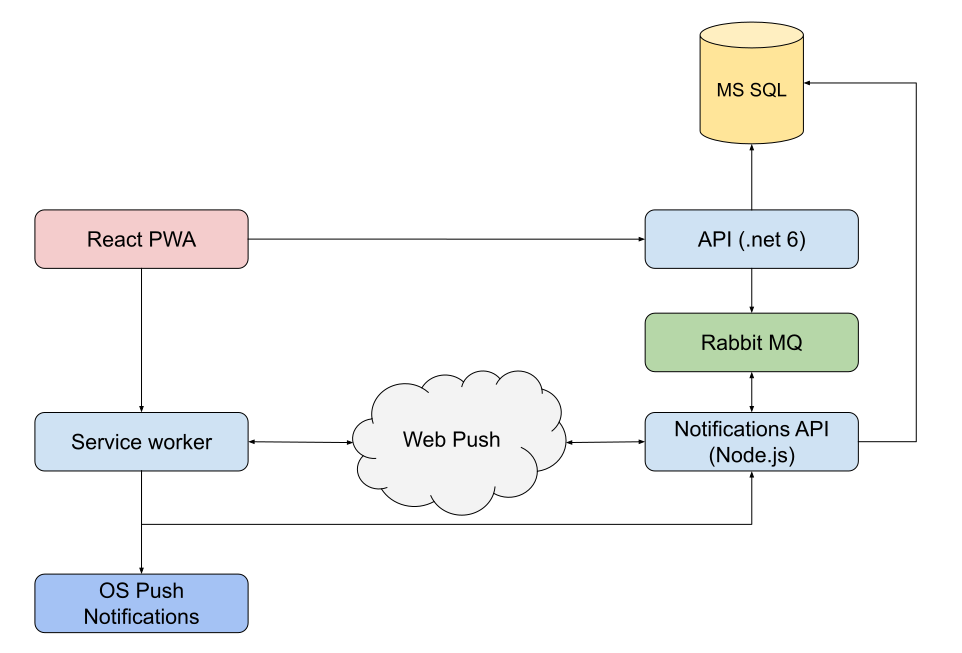

# Mobile polling application - Progressive Web application using React and .Net technologies

React PWA playground

## Architecture

## Entities

1. Examiner - entity that creates polls
2. Respondent - entity that answers polls
3. Poll - collection of questions
4. Question - there can be 4 types of questions:
    - yes/no question
    - single choice
    - multiple choice
    - text answer
5. Answer - Respondant answer to specific question