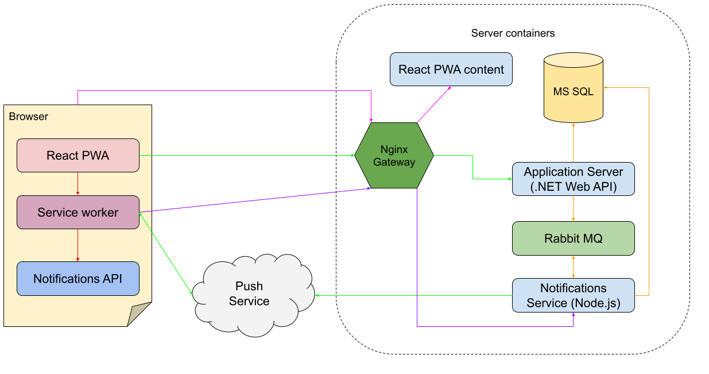
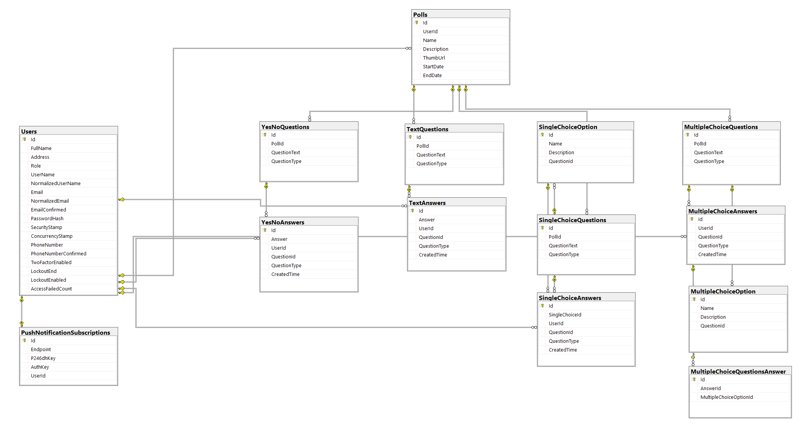

# Mobile polling application - Progressive Web application using React and .Net technologies

The purpose of this project is to demonstrate React Progressive Web App capabilities and implementation of push notifications in React Progressive Web App.

The goal was to implement push notification system for React pwa by using <a href="https://developer.mozilla.org/en-US/docs/Web/API/Service_Worker_API">Service Workers</a> and <a href="https://datatracker.ietf.org/doc/html/draft-ietf-webpush-protocol">web push protocol</a>.

Service workers essentially act as proxy servers that sit between web applications, the browser, and the network (when available). They are intended, among other things, to enable the creation of effective offline experiences, intercept network requests and take appropriate action based on whether the network is available, and update assets residing on the server. They will also allow access to push notifications and background sync APIs.

## Architecture

### How it works
- Add description of a picture below




## Compoments
### 1. <u>Polls GUI (React PWA)</u>

Progressive web apps are a (terribly named) wonderful idea. You can build an app that serves all devices and form factors once using web technologies. It can be accessed over the web but also surface on the home screen of your Android or iOS device. That app can work offline, display a splash screen when it launches, and have notifications, too.

<a href="src/frontend/polls">Polls GUI</a> is React Progressive Web App that uses <a href="https://mui.com/">Material UI</a> for styling.
All components are functional, the browser router is used for navigation through the pages and MUI components are for content.
<a href="https://axios-http.com/docs/intro">Axios</a> is used for HTTP calls.

### <u>2. Service worker</u>
<a href="src/frontend/polls/src/service-worker.js">Service Worker</a> is used to register page as a progressive web application and for handling of push notifications.

All content should be in a single js file that is publicly available on the server.

After the user logs in, PWA calls service worker registration with a link to a service worker file, once registered application can be installed in the page menu on a browser. When the browser calls Activate method from the worker lifecycle, the push manager is registered in navigation, push subscription is created on a push notifications API and user is being asked for push notifications permission.

Worker listens for push messages over a `push` event listener.

### 3. <u>Push notifications API (Node server)</u>

<a href="src/backend/Polls.PushNotifications/server.js">Push notifications API</a> is a node.js express server used to save push subscriptions and handle push notifications from server.
Server connects to MS SQL db to store and fetch push subscriptions and to a Rabbit MQ where it consumes notifications from `push-notifications-exchange` queue. Notifications can be directed to a user or for broadcasting. When a notification should be broadcasted it is first added to a broadcast queue on the Rabbit MQ and then consumed back, dispatched in batches, and returned back on a queue. This is done because if there is a huge number of users delay between two different notifications can be large.

### 4. <u>Polls API (dotnet 6 Web API)</u>

<a href="src/backend/Polls.Api">Polls API</a> is a dotnet 6 Web API used to store users and polls questions and answers. Connects to MS SQL server via Entity framework, uses Microsoft Identity for authentication.

When new poll is created API publishes on a Rabbit MQ a broadcast notification that informs all users that there is a new poll available. When someone answers a poll the owner of a poll is notified.

### 5. <u>MS SQL Server (PollsDb)</u>
   

### 7. <u>Rabbit MQ</u>

Pub/Sub used for communication between Polls API and Push notifications API.
Polls API sends notifications for direct or broadcast sanding on a `push-notifications-exchange`. Notifications API consumer messages from that queue and uses `buffer-exchange` queue for broadcasting in batches.

### 8. <u>Nginx</u>
In order for push notifications to work every app must run over HTTPS with a valid SSL certificate.
Ngnix is used as a proxy that attaches SSL certificate and redirects requests to a right port based on url.
Config can be found <a href="src/nginx-conf/nginx.conf">here</a>.

### 9. <u>Docker</u>

For easier deployment, each application has its docker image, and the environment is described in a <a href="src/docker-compose.yml">docker-compose</a> file.

Environment-specific changes should be added in a `docker-compose.{env}.yml` files.

## Problems and Solutions

1. SSL - In order for push notifications to work permission must be granted and a navigator available and for that SSL certificate is required.
2. iOS - works only over a Safari.
3. Passing user Id from React to the service worker. Since there is a limited number of event listeners that can be used for communication with service workers and we needed a user id to assign to push subscription I had to come up with a simple solution. The `push` event listener could be used but then different types of messages received on that event would complicate the coding. A simple solution is to use query parameters when fetching service worker file.

    ```js
    // serviceWorkerRegistration.js
    const swUrl = `${process.env.PUBLIC_URL}/service-worker.js?userId=${config.userId}`;
    ...
    // service-worker.js
    let userId = new URL(location).searchParams.get('userId');
    ```

## Conclusion

React Progressive Web App is very suitable for light weight mobile applications since it is fairly easy to register a website as an app that can be installed on a system and service workers and background tasks are available for background work.
Another advantage is that the application doesn't have to be installed from the App or Play Store.