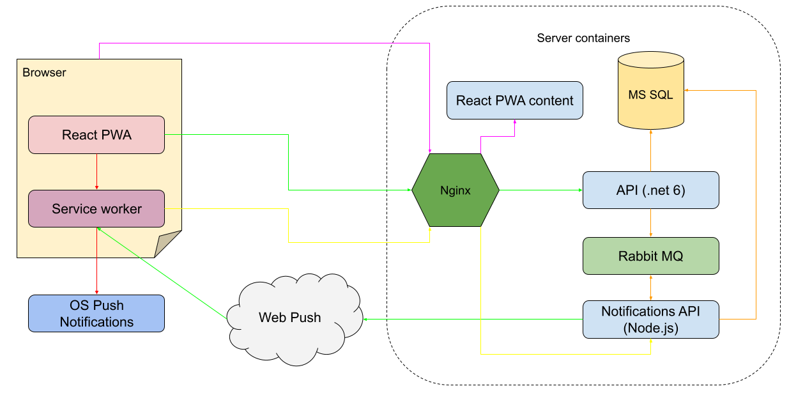
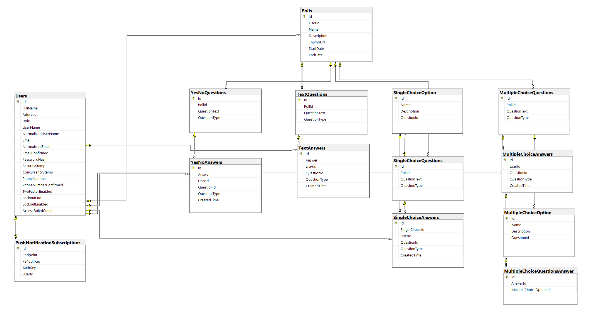

# Mobile polling application - Progressive Web application using React and .Net technologies

The purpose of this project is to demonstrate React Progressive Web App capabilities and implementation of push notifications in React Progressive Web App.

The goal was to implement push notification system for React pwa by using <a href="https://developer.mozilla.org/en-US/docs/Web/API/Service_Worker_API">Service Workers</a> and <a href="https://datatracker.ietf.org/doc/html/draft-ietf-webpush-protocol">web push protocol</a>.

Service workers essentially act as proxy servers that sit between web applications, the browser, and the network (when available). They are intended, among other things, to enable the creation of effective offline experiences, intercept network requests and take appropriate action based on whether the network is available, and update assets residing on the server. They will also allow access to push notifications and background sync APIs.

## Architecture

### How it works
- Description of a precture below

## Compoments
### 1. <u>Web application</u>
<a href="src/frontend/polls">React PWA</a> using <a href="https://mui.com/">Material UI</a> for styling.
All components are functional, the browser router is used for navigation through the pages and MUI components are for content.
<a href="https://axios-http.com/docs/intro">Axios</a> is used for http calls.

### <u>2. Service worker</u>
<a href="https://developer.mozilla.org/en-US/docs/Web/API/Service_Worker_API">Service Worker</a> is used to register page as a progressive web application and for handling of push notifications.

All content should be in a single js file that is publicly available on the server.

After the user logs in, PWA calls service worker registration with a link to a service worker file, once registered application can be installed in the page menu on a browser. When the browser calls Activate method from the worker lifecycle, the push manager is registered in navigation, and a push subscription is created on a push notifications server.

### 3. <u>Push notifications Node server</u>
Node.js express server 

### 4. <u>Dotnet 6 Web Api</u>
- EF/identity

### 5. <u>MS SQL (DB relation)</u>
   

### 7. <u>Rabbit MQ</u>

### 8. <u>Docker</u>

### 9. <u>Nginx</u>

## Problems and Solutions